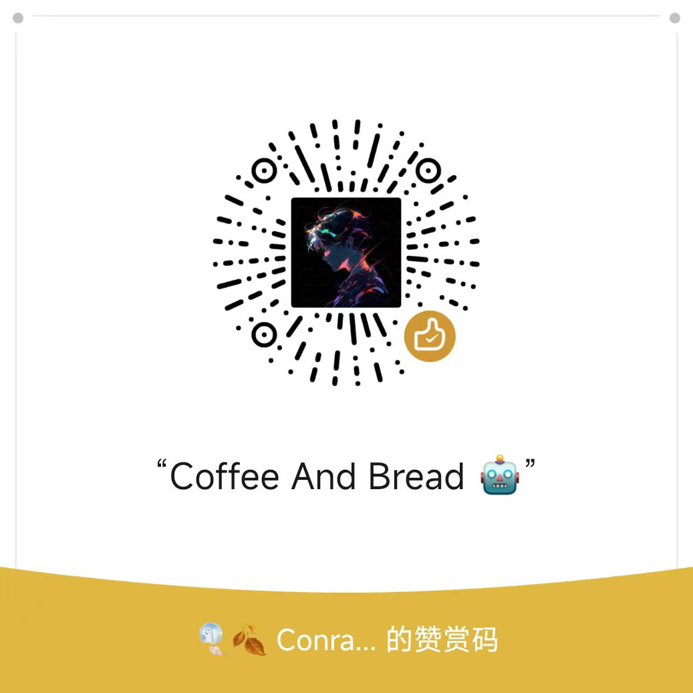

### Welcome Flow Me To Share Your Mind 👋

|Base Info|Dashboard Data|
|----------------------------------------------------------------------|----------------------------------------------------------------------|
| __Hi, I am ConradJam! 😊__  1. 🔭 I’m currently working on GuangZhou, China 2. 💪 I have rich experience in big data for games and am proficient in data platform or pipeline build 3. 📫 How to reach me: jam.gzczy@gmail.com 4. 💬 Leave me my Blog forward my open source store: https://czy006.github.io |  |

  
Here is a mini program for discount. You can scan it by wechat for detail.

  
  

 

Welcome to discuss open source technology and open source governance related topics with me. Currently I am helping open source projects to be incubated into the Apache Foundation.

###  🔧 常用工具和技能

### MyBlog

[Github-Blog](https://czy006.github.io)
｜[FlinkClub](https://github.com/czy006/FlinkClub) 
｜[Flink中文社区](https://flink-learning.org.cn/author/910723ec13d7b3d103fdc6bbfa8ea5fd)
｜[阿里云开发者社区](https://developer.aliyun.com/profile/nwcroxcgl3cc2)
｜[CSDN](https://blog.csdn.net/qq_30438573)
｜[腾讯云开发者社区](https://cloud.tencent.com/developer/user/1188124)

